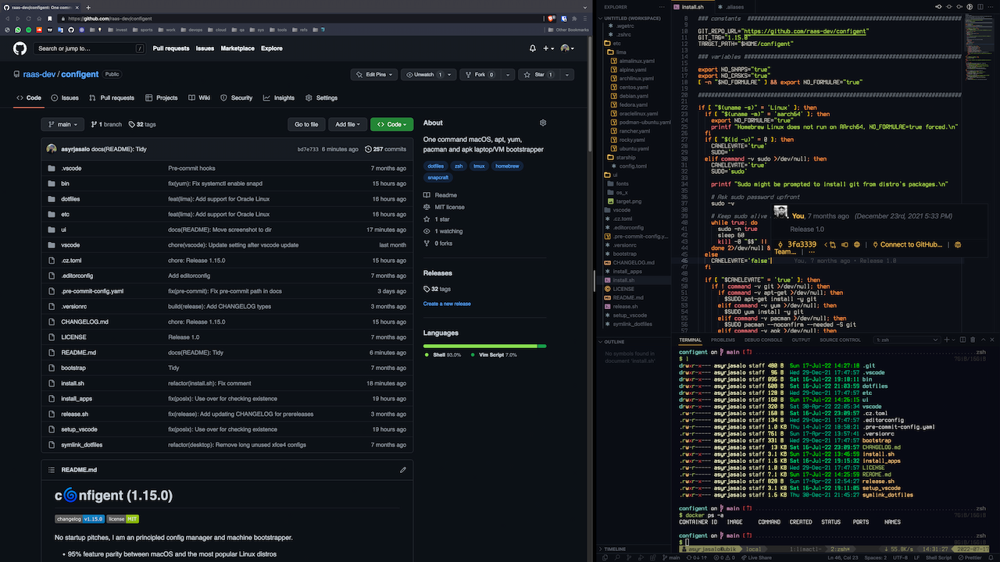

# c🌀nfigent (1.104.2)

No startup pitches, I am a DevOps principled environment bootstrapper.

- Work must finish by running one command. Mouse is not productivity.
- Does not install 10s of tools most of which can be run ad-hoc in container.
- 95% consistent user experience both on macOS and the beloved Linux distros.
- There is only one way to manage programming languages and tool versions.
- AI-first in terminal and in editor. Open Source used whenever doable.

|  |
| --------------------------------------------------------------------------- |

A few features:

- One character `.aliases`: The fastest are the commands one does not type.
- Apps are Rust, Go and C for speed, and `n`ix-shells are for ad-hoc binaries.
- macOS `docker` experience as it was with Docker Desktop but it does not cost.
- Run `up` to upgrade every package manager but respect locked tool versions.
- Quick ask GPT in terminal (`a`), code (`c`), or open chat session (`ai`).

Works on x86-64 and ARM:

- macOS Sonoma (14), Ventura (13) and Monterey (12)
- Ubuntu Linux 24.04 LTS (Noble Numbat) and 22.04 LTS (Jammy Jellyfish)
- Debian Linux 12 (Bookworm) and 11 (Bullseye)
- Fedora Linux 38, 37 and 36
- CentOS Stream 9 and 8
- AlmaLinux 9 and 8
- Rocky Linux 9 and 8
- Oracle Linux 9 and 8
- openSUSE Leap 15.4
- Arch Linux (rolling; since 2022-07)
- Alpine Linux 3.19, 3.18 and 3.17

Minimum requirements are 4GB RAM and 12GB disk, or a 2016 MacBook Pro,
both on which it is <30 minutes.

## 🥾 Up

Already existing **dotfiles are overridden without prompting**. There is no
uninstaller currently.

If in doubt, test drive in a virtual machine.

Installer requires only `curl` available:

    curl -fsSL https://raw.githubusercontent.com/raas-dev/configent/1.104.2/install.sh | sh

Things are installed primarily per-user, but to install system-wide requirements
(such as `git`), `sudo` password may be asked in the beginning.

The respective git tag from this repository is cloned in `~/configent`,
or main branch is pulled on top of the git working copy if it already exists.

User's configs (dotfiles, symlinks and directories) overridden are backed up in
`~/configent/.backup` with same directory hierarchy as they located in `$HOME`.

### Server (default)

Script `install.sh` is non-interactive and suitable for cloud-init when run as
user with passwordless sudo.

**The defaults are what is most often used in software development in cloud.**
If you want to deviate from it, the fastest is to fork this repository,
make changes and cURL your public fork.

GUI apps are not installed by `install.sh` as a server is assumed, unless you
explicitly pass `FLATPAKS=true` (Linux distros) or `CASKS=true` (macOS) to the
script.

### Desktop

Alternatively, you can run `bootstrap` in the git working copy (`~/configent`)
to install GUI apps.

Add or remove GUI apps to your liking in `bin/install_apps_flatpak`
(Flatpak on Linux distros) or `bin/install_apps_cask` (Homebrew Cask on macOS).

To use GUI apps on Linux distros, you have to install Xorg, display manager and
window manager of your choice. See your distro's own instructions for that.

## 🔋's included

Script `bootstrap` essentially handles the whole automated setup (dotfiles,
apps, editor) of the machine it is run in. These three respective scripts are
described further below.

Necessities (such as Zsh) are installed from the Linux distro's repo,
or from Homebrew if it is runnable on the OS and the CPU architecture.

The script is non-interactive: Due to this, and though Zsh is preferred, it is
not set as the user's default shell. You may do it and get prompted, possibly
asked `sudo`, by running `bin/install_zsh` after `bootstrap` has finished.

### symlink_dotfiles

Symlinks are created in in the user's home directory for all the files in
`dotfiles/`. Files or symlinks of the same name at `$HOME` are overridden.

Starship, Topgrade, Neovim and htop configs are symlinked in `~/.config`,
which is a standard config search path on many operating systems.

Directory `bin` in this repository is symlinked to `~/.local/configent/bin`,
taking 1st preference in `PATH`. Directory `etc` in this repository is
symlinked to `~/.config/configent`

Restart the shell or run `source ~/.bashrc`. Then on, you may simply reload
the configuration of the current shell (`.bashrc` or `.zshrc`) with `r` and all
the scripts in `bin/` are available by name from now on.

💡: Export your own environment variables in `~/.rclocal`. Git name and email
are automatically exported here if they were set in your previous `.gitconfig`.

### install_apps

If you want to adjust high level tech stacks, modify this script.

What's installed by default:
1. Command-line necessities and compile-time requirements
2. GUI apps by [Homebrew Cask](https://formulae.brew.sh/cask/) (macOS) or
[Flatpak](https://flatpak.org/) (Linux distros)
3. Zsh plugin manager and plugins (Zsh from `brew` if Homebrew is available)
4. Rust, Go, Node.js, Python and .NET language runtimes and default packages
5. AppSec vulnerability scanners, linters and AWS and Azure development tools
6. (Neo)vim bundles and config (Neovim from `brew` if Homebrew is available)
7. Tmux plugins and config (tmux from `brew` if Homebrew is available)
8. [Terminess](https://www.programmingfonts.org/#terminus) monospace font

Apt, yum (dnf), zypper, pacman and apk package managers are recognized and used
to install requirements from Linux distro's repository (requires `sudo` rights).
Flatpaks (GUI apps) are always installed user-wide.

On macOS, [Homebrew](https://brew.sh) is used to install requirements and
casks (GUI apps) user-wide.

Language runtimes and development tools are always installed user-wide by
[asdf](https://asdf-vm.com/). Global versions are defined in `~/.tool-versions`.
Whenever possible, [asdf plugins](https://github.com/asdf-vm/asdf-plugins)
are preferred over Homebrew.

⚠️: Homebrew may or may not be present after installation, as Homebrew Linux
[does not work on ARM](https://docs.brew.sh/Homebrew-on-Linux#arm-unsupported).

With Homebrew on Linux (x86-64), system-wide installation (`/home/linuxbrew`) is
preferred, but if it this not possible (no `sudo`), it is installed user's home.
In both cases, Zsh, Neovim and tmux are installed using Homebrew on Linux,
as it likely has newer versions than the ones gotten from the distro's repo.

💡: See [asdf documentation](https://asdf-vm.com/manage/versions.html#set-current-version) for locking project specific versions.

### setup_vscode / setup_vscodium

[VSCodium](https://vscodium.com/) is the default editor on Linux distros and
[VSCode](https://code.visualstudio.com/) is the default on macOS.

The script symlinks `vscode/` to `<os_specific_path>/User`. Existing `User`
directory is first backed up to `~/configent/.backup/<os_specific_path>/User`.

If editor is present, its extensions (`vscode/extensions.list`) are installed
using the command-line tool of the editor.

To update the list after adding or removing extensions in VSCode/VSCodium,
run `vscode/create_extensions_list`.

## 🐚 Default shell

Set `zsh` as the user's default shell:

    install_zsh

If you prefer `bash` instead:

    install_bash

If Homebrew is available (Linux distros on x86-64, macOS on x86-64 or ARM),
Zsh and Bash are installed from Homebrew and preferred over system-wide shells
(respectively), as Homebrew likely has newer versions available.

## 🏗️ Containers

[Rootless containers](https://rootlesscontaine.rs/) in a nutshell:

- there are various OCI compatible runtimes, such as Docker (in Docker Desktop)
- containerd is the industry-standard (CNCF) runtime in Kubernetes deployments
- third option is Podman, which is near-Docker compatible daemonless runtime

These `bin/` shims wrap the container CLIs to prefer rootless runtimes:

- `docker`: Runs Docker CLI, installing build and compose CLI plugins when used
- `nerdctl`: Runs nerdctl (on containerd), which has build and compose built-in
- `podman`: Runs Podman CLI (on daemonless Podman), but lacks proper compose

### macOS

Container runtimes base on Linux kernel features not present on macOS. Thus
[Lima](https://github.com/lima-vm/lima) is used for creating Linux VMs on QEMU.

The aforementioned shims create and start the necessary virtual machines:
VM 'ubuntu' for rootless Docker, VM 'debian' for rootless containerd
and VM 'fedora' for rootless Podman.

In addition, VM 'debian' has [k3s](https://k3s.io/) for testing on Kubernetes.
See VM's startup message for exporting `KUBECONFIG` to use it with `kubectl`.

The following host directories are mounted read-write for VMs:

- `$HOME/dev`
- `$HOME/Downloads`
- `/tmp/lima`

### docker shortcut

Alias `d` is a shortcut for building Docker image in the current directory.
`Dockerfile` is read if present, otherwise [nixpacks](https://nixpacks.com/)
is used to detect the tech stack and build the image best-effort.

⚠️: Ensure the Docker image you are building `FROM` is safe before proceeding.

After the image is built, a new container is launched from it. If `.env` file
is present in the current directory, its environment variables are set in the
container.

If you use `PORT=8000 d`, the port given is mapped to the host and environment
variable `PORT` is set inside the container. Note that this takes precedence
if `PORT` is also defined in `.env` file.

If `d -d` or `d --detached` is used, all arguments are passed to `docker run`.
CMD defined in `Dockerfile` is effective. ENTRYPOINT defined in `Dockerfile`
(or by `nixpacks`) is effective, unless you override it in arguments.

If container was started as detached and successfully started up, docker logs
are followed. Sending `^C` exits the log view and does not stop the container.

If `-d` or `--detached` is not used, an interactive session is assumed and all arguments are passed to `docker run` entrypoint `/bin/sh -c` as commands, e.g.
`d bash` starts Bash in the container. Exiting the shell stops the container.

⚠️: If container writes to filesystem, you must be in a VM writable directory.

## ❄️ Nix

[Nix](https://nix.dev/) is not installed on the host, but alias `nixd` starts
a container where `nix`, `nix-env`, `nix-shell`, etc. are available.
The container image is built by `etc/nix/Containerfile`.

The environment is created in the current directory and alias `n` is used e.g.
`n vim README.md` to run Vim in an isolated `nix-shell` on containerd.

Package name(s, separated by forward slashes) are taken as the first argument.
The packages are installed from channel
[unstable](https://search.nixos.org/packages?channel=unstable).

The binary is assumed named according to the first package. The rest of the
arguments are passed to the binary. If binary name is different from the
package name, put meta-package "shell" first, e.g. `n shell/postgresql psql`.

You can expose `PORT` on the host, e.g. `PORT=8000 n python3 -m http.server`.

⚠️: If binary writes to filesystem, you must be in a VM writable directory.

💡: Use `n` for command-line tools not wanted permanently installed on the
host. See `.aliases` for example ad-hoc tools such as container image scanners.

## 🔨 QEMU

See `dotfiles/.aliases` for `vm4...` creating
[Lima](https://github.com/lima-vm/lima) VMs to test on various Linux distros.

💡: See alias `v` for starting, shelling into, stopping and deleting a VM.

VMs are provisioned by [cloud-init](https://cloudinit.readthedocs.io/en/latest/)
on boot by pulling and running `install.sh` from this repository's main branch.

⚠️: Regardless of pulling main, the version to install is defined in
`install.sh` and is only updated by `release.sh`.

You may willingly live on the edge by explicitly passing `GIT_REF`:

    curl -fsSL https://raw.githubusercontent.com/raas-dev/configent/main/install.sh | GIT_REF=main sh

For development purposes, once the VM has been started, host's `$HOME/configent`
is mounted read-only in the VM. This enables testing most changes without first
committing and pushing to your fork.
