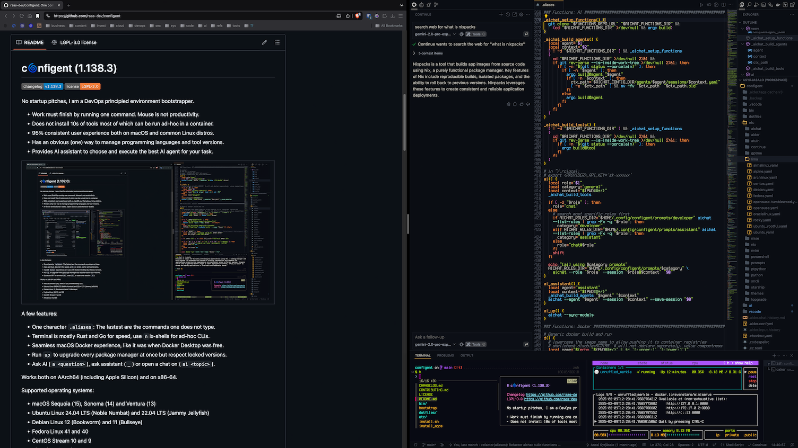

# c🌀nfigent (1.15.0)

 

No startup pitches, I am an principled config manager and machine bootstrapper.

- 95% feature parity between macOS and the most popular Linux distros
- Scripts over cmdline options - keep it simple, comment out unwanted parts
- There is actually one, and only one, way to do things - the most efficient
- If something switches context faster than `tmux` and `zsh`, we'll switch to it
- The fastest open source web browser, VSCode and killer terminal. That's it.

|  |
| --------------------------------------------------------------------------- |

Features:

- Bootstrap macOS or common Linux distros with one command, only `curl` required
- One character shell aliases - the fastest are the commands one does not write
- In terminal, Rust and Go written utilities are always preferred due to speed
- Multiple language versions with `rustup`, `gvm`, `nvm` `pyenv` and `rbenv`
- Run `docker` and `nerdctl` from macOS, by lima VMs for dockerd and containerd

Works on:

- macOS Monterey (12), Big Sur (11) and Catalina (10)
- Ubuntu Linux 22.04 LTS (Jammy Jellyfish) and 21.10 (Impish Indri)
- Debian Linux 11 (bullseye)
- Fedora Linux 36 and 35
- Rocky Linux 8.6 and 8.5
- CentOS Stream 8
- AlmaLinux 8.6
- Oracle Linux 8.6
- Arch Linux (rolling; since 2022-07)
- Alpine Linux 3.16, 3.15 and 3.14

Things are happening per user, but `sudo` may be used for some OS features.

## 💣 Up

**Note: The script overrides your current dotfiles at $HOME without prompting.**

    curl -fsSL https://raw.githubusercontent.com/raas-dev/configent/1.15.0/install.sh | sh

If git is not present on the machine, it is installed first by the Linux
distro's package manager or by Xcode cmdline tools on macOS.

Then the respective tag from this git repo is cloned as `$HOME/configent`,
or main branch is pulled on top of it if the git working copy already exists.

### Customization

Nothing is prompted by `install.sh`, it's non-interactive and thus suitable
for cloud-init: Fork this repo, comment out the tech stacks you don't need
in `install_apps`, and change the curl target to your public fork.

GUI apps are not installed by `install.sh` as a server or VM is assumed. Re-run
`./bootstrap` in the repo (after `install.sh` finishes) to install GUI apps.

Add or remove GUI apps to your liking in `bin/install_apps_snap`
(Snap on Linux distros) and `bin/install_apps_cask` (Homebrew Cask on macOS).

## 🔋's included

Script `bootstrap` runs the three below scripts in the order described.

This script essentially handles the whole automated setup (dotfiles, apps,
VSCode, zsh) of the machine it is run in and is non-interactive.

The [default shell](https://github.com/raas-dev/configent#-default-shell)
is not changed to zsh (as there is chance that zsh installation has failed),
but you may do it (and get prompted) by running `bin/install_zsh` after
`bootstrap` has finished.

### ⚙️ symlink_dotfiles

Creates symlinks in the user's home directory for all the files in  `dotfiles/`.

Script `bootstrap` passes `-f` to `symlink_dotfiles` to skip override prompts
per already existing file or symlink in the user's home directory.

Directory `bin` is symlinked to `~/local/bin`, taking 1st preference in `PATH`.
If `~/local/bin` already exists, it is backed up as `~/local/bin-old`.

Restart the shell or run `source ~/.zshrc`. Then you may simply reload with `r`.

All the binaries in `bin/` are available by name from now on.

### 🖥️ install_apps

MacOS, APT, YUM and pacman based distros, as well as Alpine Linux, are known.

**On ARM64 Linux distros, Homebrew parts are skipped (see [Known bugs](https://github.com/raas-dev/configent#known-bugs)).**

Order of installation:
1. [Homebrew](https://brew.sh/) if it is not already in `PATH`
2. [Homebrew Cask](https://formulae.brew.sh/cask/) and casks (macOS) or
[Snap](https://snapcraft.io/) (Linux distros) and snaps
3. [Terminess](https://www.programmingfonts.org/#terminus) monospace font
4. Vim bundles, and if `brew` is present, Neovim
5. Rust, Go, Node, Python and Ruby version managers and the language versions
6. Zsh, tmux, command-line utilities, cloud and infrastructure-as-code tools

### 🖊️ setup_vscode

The script symlinks `vscode/` to `<os_vscode_path>/Code`.
The old `Code/` is first backed up as `Code-old`.

This is done even if `code` is not (yet) installed.
If `code` is present, VSCode extensions are installed.

## 🐚 Default shell

Set the brew installed `zsh` as the user's default shell:

    install_zsh

If you prefer `bash` instead, brew the latest Bash and set it as default:

    install_bash

## 🏗️ dockerd and containerd

Couple of things to understand:

- the two are different runtimes - if you used Docker Desktop, it was dockerd
- containerd is the de facto runtime in production Kubernetes - thus prefer it
- regardless of runtime, `sudo` is always a bad idea when it comes to security

On macOS, these shims wrap the respective runtime CLIs to run inside Linux VMs:

- `docker`: Runs docker cli and prefers rootless dockerd (no sudo is required)
- `docker-compose`: Installs and runs docker-compose as a docker cli plugin
- `nerdctl`: Runs nerdctl (also `nerdctl compose`) in user context containerd

The shims are available in non-interactive sessions, while `~/.aliases` is
sourced only in terminals where STDIN (effectively keyboard) is present.

[Lima](https://github.com/lima-vm/lima) is used for managing Linux VMs on QEMU.

The shims create or start the necessary virtual machines, a lima VM named
'ubuntu' for running rootless dockerd and a lima VM 'rancher' for containerd.

In addition, VM 'rancher' includes [k3s](https://k3s.io/) for local Kubernetes.

Tip: Use aliases `d` and `n` as generic shortcuts for starting containers in
`docker` or `nerdctl` respectively, as long as the current working directory has
`Dockerfile` present. The host-container mapped ports are output by the aliases.

## 🔨 Development

See `dotfiles/.aliases` for `vm4...` for self-testing on various Linux distros
on [lima](https://github.com/lima-vm/lima).

See alias `v` for shelling into, stopping and deleting the VM.

VMs are provisioned by [cloud-init](https://cloudinit.readthedocs.io/en/latest/)
on boot by fetching and running `install.sh` from the remote repo's main branch.

Once VM has been started, your host's `$HOME` directory is mounted to the VM.

Use it to test script changes without first commiting and pushing to the remote repo/your fork.

### Contributing

Install or upgrade [pre-commit](https://pre-commit.com/) and install the hooks:

    pip3 install --user --upgrade pre-commit
    pre-commit install --hook-type pre-commit
    pre-commit install --hook-type commit-msg

### Known bugs

Please create an [issue](https://github.com/raas-dev/configent/issues) and
a pull request.

#### Out of scope

- Homebrew on Linux: Is not officially supported ("by best effort") on AArch64
    - Hack1: Installer can be patched to skip the AArch64 check
    - Hack2: Requirement Ruby 2.6.8 can be installed system-wide from source
    - Showstopper: Most formulaes do not have AArch64 binaries ("bottles")
        - Building all dependencies from source would be too long as a bootstrap
- Alpine Linux: Homebrew on Linux does not work as Alpine Linux has no glibc
- Arch Linux: Installing `snapd` fails even though deps are present (2022-07)
    - error: `Package libseccomp was not found in the pkg-config search path.`
- Fedora Linux: Must reboot after `squashfuse` installation for `snap` to work
    - error: `system does not fully support snapd: cannot mount squashfs image using "squashfs"`
