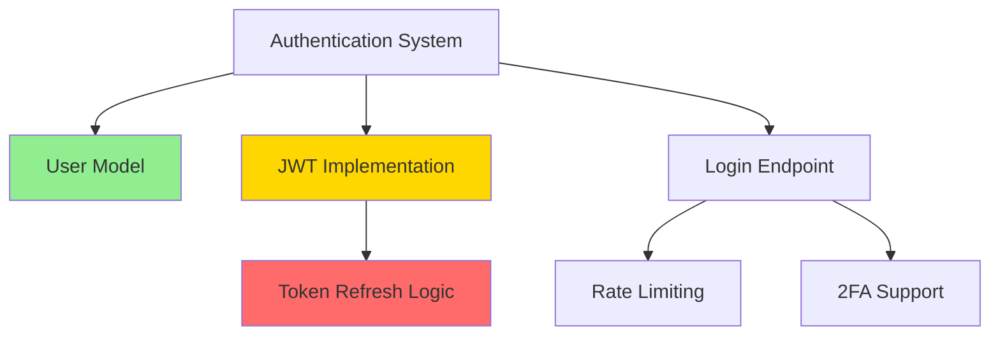

# dependency-mapper

Map and analyze project dependencies

## Purpose
This command analyzes code dependencies, git history, and Linear tasks to create visual dependency maps. It helps identify blockers, circular dependencies, and optimal task ordering for efficient project execution.

## Usage
```bash
# Map dependencies for a specific Linear task
claude "Show dependency map for task LIN-123"

# Analyze code dependencies in a module
claude "Map dependencies for src/auth module"

# Find circular dependencies in the project
claude "Check for circular dependencies in the codebase"

# Generate task execution order
claude "What's the optimal order to complete tasks in sprint SPR-45?"
```

## Instructions

### 1. Analyze Code Dependencies
Use various techniques to identify dependencies:

```bash
# Find import statements (JavaScript/TypeScript)
rg "^import.*from ['\"](\.\.?/[^'\"]+)" --type ts --type js -o | sort | uniq

# Find require statements (Node.js)
rg "require\(['\"](\.\.?/[^'\"]+)['\"]" --type js -o

# Analyze Python imports
rg "^from \S+ import|^import \S+" --type py

# Find module references in comments
rg "TODO.*depends on|FIXME.*requires|NOTE.*needs" -i
```

### 2. Extract Task Dependencies from Linear
Query Linear for task relationships:

```javascript
// Get task with its dependencies
const task = await linear.getTask(taskId, {
  include: ['blockedBy', 'blocks', 'parent', 'children']
});

// Find mentions in task descriptions
const mentions = task.description.match(/(?:LIN-|#)\d+/g);

// Get related tasks from same epic/project
const relatedTasks = await linear.searchTasks({
  projectId: task.projectId,
  includeArchived: false
});
```

### 3. Build Dependency Graph
Create a graph structure:

```javascript
class DependencyGraph {
  constructor() {
    this.nodes = new Map(); // taskId -> task details
    this.edges = new Map(); // taskId -> Set of dependent taskIds
  }

  addDependency(from, to, type = 'blocks') {
    if (!this.edges.has(from)) {
      this.edges.set(from, new Set());
    }
    this.edges.get(from).add({ to, type });
  }

  findCycles() {
    const visited = new Set();
    const recursionStack = new Set();
    const cycles = [];

    const hasCycle = (node, path = []) => {
      visited.add(node);
      recursionStack.add(node);
      path.push(node);

      const neighbors = this.edges.get(node) || new Set();
      for (const { to } of neighbors) {
        if (!visited.has(to)) {
          if (hasCycle(to, [...path])) return true;
        } else if (recursionStack.has(to)) {
          // Found cycle
          const cycleStart = path.indexOf(to);
          cycles.push(path.slice(cycleStart));
        }
      }

      recursionStack.delete(node);
      return false;
    };

    for (const node of this.nodes.keys()) {
      if (!visited.has(node)) {
        hasCycle(node);
      }
    }

    return cycles;
  }

  topologicalSort() {
    const inDegree = new Map();
    const queue = [];
    const result = [];

    // Calculate in-degrees
    for (const [node] of this.nodes) {
      inDegree.set(node, 0);
    }

    for (const [_, edges] of this.edges) {
      for (const { to } of edges) {
        inDegree.set(to, (inDegree.get(to) || 0) + 1);
      }
    }

    // Find nodes with no dependencies
    for (const [node, degree] of inDegree) {
      if (degree === 0) queue.push(node);
    }

    // Process queue
    while (queue.length > 0) {
      const node = queue.shift();
      result.push(node);

      const edges = this.edges.get(node) || new Set();
      for (const { to } of edges) {
        inDegree.set(to, inDegree.get(to) - 1);
        if (inDegree.get(to) === 0) {
          queue.push(to);
        }
      }
    }

    return result;
  }
}
```

### 4. Generate Visual Representations

#### ASCII Tree View
```
LIN-123: Authentication System
├─ LIN-124: User Model [DONE]
├─ LIN-125: JWT Implementation [IN PROGRESS]
│  └─ LIN-126: Token Refresh Logic [BLOCKED]
└─ LIN-127: Login Endpoint [TODO]
   ├─ LIN-128: Rate Limiting [TODO]
   └─ LIN-129: 2FA Support [TODO]
```

#### Mermaid Diagram


#### Dependency Matrix
```
         | LIN-123 | LIN-124 | LIN-125 | LIN-126 | LIN-127 |
---------|---------|---------|---------|---------|---------|
LIN-123  |    -    |    →    |    →    |         |    →    |
LIN-124  |         |    -    |         |         |         |
LIN-125  |         |    ←    |    -    |    →    |         |
LIN-126  |         |         |    ←    |    -    |         |
LIN-127  |    ←    |    ←    |         |         |    -    |

Legend: → depends on, ← is dependency of
```

### 5. Analyze File Dependencies
Map code structure to tasks:

```javascript
// Analyze file imports
async function analyzeFileDependencies(filePath) {
  const content = await readFile(filePath);
  const imports = extractImports(content);

  const dependencies = {
    internal: [], // Project files
    external: [], // npm packages
    tasks: []     // Related Linear tasks
  };

  for (const imp of imports) {
    if (imp.startsWith('.')) {
      dependencies.internal.push(resolveImportPath(filePath, imp));
    } else {
      dependencies.external.push(imp);
    }

    // Check if file is mentioned in any task
    const tasks = await linear.searchTasks(path.basename(filePath));
    dependencies.tasks.push(...tasks);
  }

  return dependencies;
}
```

### 6. Generate Execution Order
Calculate optimal task sequence:

```javascript
function calculateExecutionOrder(graph) {
  const order = graph.topologicalSort();
  const taskDetails = [];

  for (const taskId of order) {
    const task = graph.nodes.get(taskId);
    const dependencies = Array.from(graph.edges.get(taskId) || [])
      .map(({ to }) => to);

    taskDetails.push({
      id: taskId,
      title: task.title,
      estimate: task.estimate || 0,
      dependencies,
      assignee: task.assignee,
      criticalPath: isOnCriticalPath(taskId, graph)
    });
  }

  return taskDetails;
}
```

### 7. Error Handling
```javascript
// Check for Linear access
if (!linear.available) {
  console.warn("Linear MCP not available, using code analysis only");
  // Fall back to code-only analysis
}

// Handle circular dependencies
const cycles = graph.findCycles();
if (cycles.length > 0) {
  console.error("Circular dependencies detected:");
  cycles.forEach(cycle => {
    console.error(`  ${cycle.join(' → ')} → ${cycle[0]}`);
  });
}

// Validate task existence
for (const taskId of mentionedTasks) {
  try {
    await linear.getTask(taskId);
  } catch (error) {
    console.warn(`Task ${taskId} not found or inaccessible`);
  }
}
```

## Example Output

```
Analyzing dependencies for Epic: Authentication System (LIN-123)

📊 Dependency Graph:
━━━━━━━━━━━━━━━━━━━━━━━━━━━━━━━━━━━━━━━━━━━━━━━━━━━

LIN-123: Authentication System [EPIC]
├─ LIN-124: Create User Model ✅ [DONE]
│  └─ Files: src/models/User.ts, src/schemas/user.sql
├─ LIN-125: Implement JWT Service 🚧 [IN PROGRESS]
│  ├─ Files: src/services/auth/jwt.ts
│  ├─ Depends on: LIN-124
│  └─ LIN-126: Add Token Refresh ⛔ [BLOCKED by LIN-125]
└─ LIN-127: Create Login Endpoint 📋 [TODO]
   ├─ Files: src/routes/auth/login.ts
   ├─ Depends on: LIN-124, LIN-125
   ├─ LIN-128: Add Rate Limiting 📋 [TODO]
   └─ LIN-129: Implement 2FA 📋 [TODO]

🔄 Circular Dependencies: None found

📈 Critical Path:
1. LIN-124 (User Model) - 2 points ✅
2. LIN-125 (JWT Service) - 3 points 🚧
3. LIN-126 (Token Refresh) - 1 point ⛔
4. LIN-127 (Login Endpoint) - 2 points 📋
Total: 8 points on critical path

👥 Task Distribution:
- Alice: LIN-125 (in progress), LIN-126 (blocked)
- Bob: LIN-127 (ready to start)
- Unassigned: LIN-128, LIN-129

📁 File Dependencies:
src/routes/auth/login.ts
  └─ imports from:
     ├─ src/models/User.ts (LIN-124) ✅
     ├─ src/services/auth/jwt.ts (LIN-125) 🚧
     └─ src/middleware/rateLimiter.ts (LIN-128) 📋

⚡ Recommended Action:
Priority should be completing LIN-125 to unblock 3 dependent tasks.
Bob can start on LIN-124 prerequisite work while waiting.
```

## Advanced Features

### Impact Analysis
Show what tasks are affected by changes:
```bash
# What tasks are impacted if we change User.ts?
claude "Show impact analysis for changes to src/models/User.ts"
```

### Sprint Planning
Optimize task order for sprint capacity:
```bash
# Generate sprint plan considering dependencies
claude "Plan sprint with 20 points capacity considering dependencies"
```

### Risk Assessment
Identify high-risk dependency chains:
```bash
# Find longest dependency chains
claude "Show tasks with longest dependency chains in current sprint"
```

## Tips
- Update dependencies as code evolves
- Use consistent naming between code modules and tasks
- Mark external dependencies (APIs, services) explicitly
- Review dependency graphs in sprint planning
- Keep critical path tasks assigned and monitored
- Use dependency data for accurate sprint velocity
