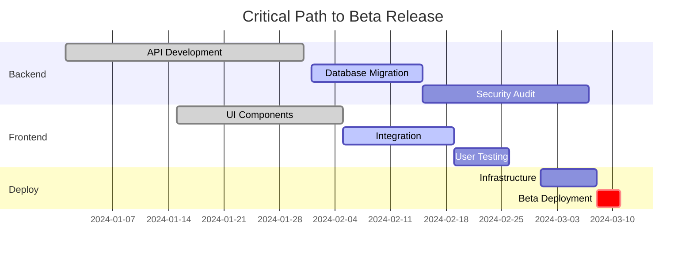

# Milestone Tracker

Track and monitor project milestone progress

## Instructions

1. **Check Available Tools**
   - Verify Linear MCP server connection
   - Check GitHub CLI availability
   - Test git repository access
   - Ensure required permissions

2. **Gather Milestone Data**
   - Query Linear for project milestones and roadmap items
   - Fetch GitHub milestones and their associated issues
   - Analyze git tags for historical release patterns
   - Review project documentation for roadmap information
   - Collect all active and upcoming milestones

3. **Analyze Milestone Progress**
   For each milestone:
   - Count completed vs. total tasks
   - Calculate percentage complete
   - Measure velocity trends
   - Identify blocking issues
   - Track time remaining

4. **Perform Predictive Analysis**
   - Calculate burn-down rate from historical data
   - Project completion dates based on velocity
   - Factor in team capacity and holidays
   - Identify critical path items
   - Assess confidence levels for predictions

5. **Risk Assessment**
   Evaluate each milestone for:
   - Schedule risk (falling behind)
   - Scope risk (expanding requirements)
   - Resource risk (team availability)
   - Dependency risk (blocked by others)
   - Technical risk (unknowns)

6. **Generate Milestone Report**
   Create comprehensive report showing:
   - Milestone timeline visualization
   - Progress indicators for each milestone
   - Predicted completion dates with confidence
   - Risk heat map
   - Recommended actions for at-risk items

7. **Track Dependencies**
   - Map inter-milestone dependencies
   - Identify cross-team dependencies
   - Highlight critical path
   - Show dependency impact on schedule

8. **Provide Recommendations**
   Based on analysis:
   - Suggest scope adjustments
   - Recommend resource reallocation
   - Propose timeline changes
   - Identify quick wins
   - Highlight blockers needing attention

## Prerequisites
- Git repository access
- Linear MCP server connection (preferred)
- GitHub milestones or project boards
- Historical velocity data

## Command Flow

### 1. Milestone Discovery
```
1. Check Linear for project milestones/roadmap items
2. Scan GitHub for milestone definitions
3. Analyze git tags for release history
4. Review README/docs for project roadmap
5. Ask user for additional context if needed
```

### 2. Comprehensive Milestone Analysis

#### Data Collection Sources
```
Linear/Project Management:
- Milestone definitions and due dates
- Associated tasks and dependencies
- Team assignments and capacity
- Progress percentages
- Blocker status

GitHub:
- Milestone issue tracking
- PR associations
- Release tags and dates
- Branch protection rules

Git History:
- Commit velocity trends
- Feature branch lifecycle
- Release cadence patterns
- Contributor availability
```

### 3. Milestone Status Report

```markdown
# Milestone Tracking Report - [Project Name]
Generated: [Date]

## Executive Summary
- Total Milestones: [Count]
- On Track: [Count] ([%])
- At Risk: [Count] ([%])
- Blocked: [Count] ([%])
- Completed: [Count] ([%])

## Milestone Dashboard

### 🎯 Current Sprint Milestone: [Name]
**Target Date**: [Date] (in [X] days)
**Confidence Level**: [High/Medium/Low]

Progress: ████████░░ 80% Complete

**Key Deliverables**:
- ✅ User Authentication System
- ✅ Database Schema Migration
- 🔄 API Integration (75%)
- ⏳ Documentation Update (0%)
- ❌ Performance Testing (Blocked)

**Health Indicators**:
- Velocity Trend: ↓ Declining (-15%)
- Burn Rate: 🔴 Behind Schedule
- Risk Level: Medium
- Team Capacity: 85% allocated

### 📅 Upcoming Milestones

#### Q1 2024: Beta Release
**Target**: March 15, 2024
**Status**: 🟡 At Risk

Timeline:
```
Jan ████████████░░░░░░░░ 60%
Feb ░░░░░░░░░░░░░░░░░░░░ 0%
Mar ░░░░░░░░░░░░░░░░░░░░ 0%
```

**Dependencies**:
- Alpha Testing Complete ✅
- Security Audit (In Progress)
- Marketing Website (Not Started)

**Predicted Completion**: March 22 (+7 days)
**Confidence**: 65%

#### Q2 2024: Public Launch
**Target**: June 1, 2024
**Status**: 🟢 On Track

Key Milestones Path:
1. Beta Release → 2. User Feedback Integration → 3. Production Deployment

**Critical Path Items**:
- Infrastructure Setup (Start: April 1)
- Load Testing (Duration: 2 weeks)
- Security Certification (Lead time: 4 weeks)
```

### 4. Predictive Analytics

```markdown
## Completion Predictions

### Machine Learning Model Predictions
Based on historical data and current velocity:

**Beta Release Probability**:
- On Time (Mar 15): 35%
- 1 Week Delay: 45%
- 2+ Week Delay: 20%

**Factors Influencing Prediction**:
1. Current velocity 15% below plan
2. 2 critical dependencies unresolved
3. Team member on leave next week
4. Historical milestone success rate: 72%

### Monte Carlo Simulation Results
Running 1000 simulations based on task estimates:

```
Completion Date Distribution:
Mar 10-15: ████ 20%
Mar 16-22: ████████ 40%
Mar 23-31: ██████ 30%
April+   : ██ 10%

P50 Date: March 19
P90 Date: March 28
```

### Risk-Adjusted Timeline
Recommended buffer: +5 days
Confident delivery date: March 20
```

### 5. Dependency Tracking

```markdown
## Milestone Dependencies

### Critical Path Analysis


### Dependency Risk Matrix
| Dependency | Impact | Likelihood | Mitigation |
|------------|--------|------------|------------|
| Security Audit Delay | High | Medium | Start process early |
| API Rate Limits | Medium | Low | Implement caching |
| Team Availability | High | High | Cross-training needed |
```

### 6. Early Warning System

```markdown
## ⚠️ Milestone Alerts

### Immediate Attention Required

**1. Performance Testing Blocked**
- Blocker: Test environment not available
- Impact: Beta release at risk
- Days blocked: 3
- Recommended action: Escalate to DevOps

**2. Documentation Lagging**
- Progress: 0% (Should be 40%)
- Impact: User onboarding compromised
- Resource needed: Technical writer
- Recommended action: Reassign team member

### Trending Concerns

**Velocity Decline**
- 3-week trend: -15%
- Projected impact: 1-week delay
- Root cause: Increased bug fixes
- Recommendation: Add bug buffer to estimates

**Scope Creep Detected**
- New features added: 3
- Impact on timeline: +5 days
- Recommendation: Defer to next milestone
```

### 7. Actionable Recommendations

```markdown
## Recommended Actions

### This Week
1. **Unblock Performance Testing**
   - Owner: [Name]
   - Action: Provision test environment
   - Due: Friday EOD

2. **Documentation Sprint**
   - Owner: [Team]
   - Action: Dedicate 2 days to docs
   - Target: 50% completion

### Next Sprint
1. **Velocity Recovery Plan**
   - Reduce scope by 20%
   - Focus on critical path items
   - Defer nice-to-have features

2. **Risk Mitigation**
   - Add 5-day buffer to timeline
   - Daily standups for blocked items
   - Escalation path defined

### Process Improvements
1. Set up automated milestone tracking
2. Weekly milestone health reviews
3. Dependency check before sprint planning
```

## Error Handling

### No Milestone Data
```
"No milestones found in Linear or GitHub.

To set up milestone tracking:
1. Define milestones in Linear/GitHub
2. Associate tasks with milestones
3. Set target completion dates

Would you like me to:
- Help create milestone structure?
- Import from project documentation?
- Set up basic milestones?"
```

### Insufficient Historical Data
```
"Limited historical data for predictions.

Available data: [X] weeks
Recommended: 12+ weeks for accurate predictions

Current analysis based on:
- Available velocity data
- Industry benchmarks
- Task complexity estimates

Confidence level: Low-Medium"
```

## Interactive Features

### What-If Analysis
```
"Explore scenario planning:

1. What if we add 2 more developers?
   → Completion date: -5 days
   → Confidence: +15%

2. What if we cut scope by 20%?
   → Completion date: -8 days
   → Risk level: Low

3. What if key developer is unavailable?
   → Completion date: +12 days
   → Risk level: Critical"
```

### Milestone Optimization
```
"Optimization opportunities detected:

1. **Parallelize Tasks**
   - Tasks A & B can run simultaneously
   - Time saved: 1 week

2. **Resource Reallocation**
   - Move developer from Task C to Critical Path
   - Impact: 3 days earlier completion

3. **Scope Adjustment**
   - Defer features X, Y to next milestone
   - Impact: Meet original deadline"
```

## Export & Integration Options

1. **Gantt Chart Export** (Mermaid/PNG/PDF)
2. **Executive Dashboard** (HTML/PowerBI)
3. **Status Updates** (Slack/Email/Confluence)
4. **Risk Register** (Excel/Linear/Jira)
5. **Calendar Integration** (ICS/Google/Outlook)

## Automation Capabilities

```
"Set up automated milestone monitoring:

1. Daily health checks at 9 AM
2. Weekly trend reports on Fridays
3. Alert when milestones go off-track
4. Slack notifications for blockers
5. Auto-create Linear tasks for risks

Configure automation? [Y/N]"
```

## Best Practices

1. **Update Frequently**: Daily progress updates improve predictions
2. **Track Dependencies**: Most delays come from dependencies
3. **Buffer Realistically**: Use historical data for buffers
4. **Communicate Early**: Flag risks as soon as detected
5. **Focus on Critical Path**: Not all tasks equally impact timeline
6. **Learn from History**: Analyze past milestone performance
